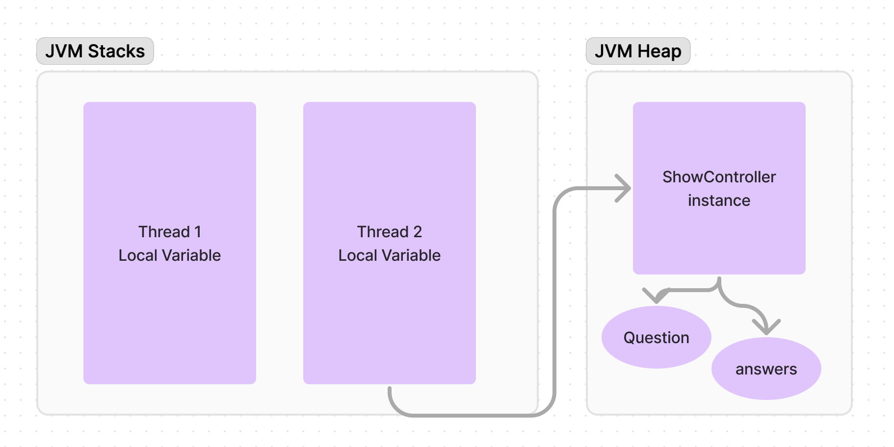
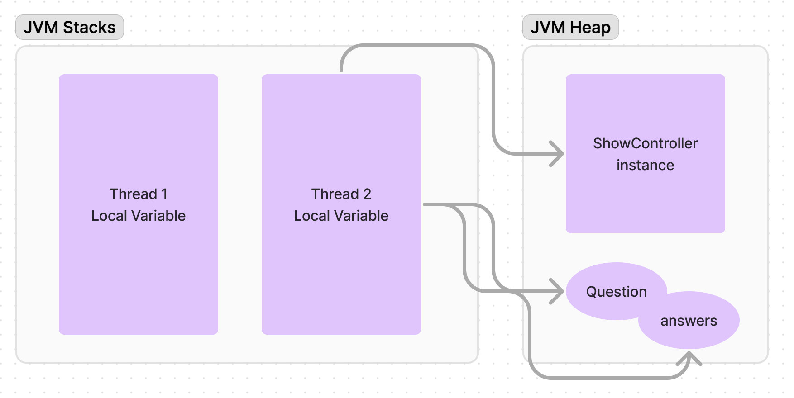

#multithread #java #JVM 

본 글은 [자바 웹 프로그래밍 Next Step](https://m.yes24.com/Goods/Detail/31869154)를 읽으면 마주한 문제에 대해서 다룹니다. (책 추천합니다!)

# 문제 상황 

서블릿 컨테이너에 의해서 `Controller` 인스턴스는 하나만 생성된다. 그러나 멀티 스레딩 환경에서 여러 스레드가 하나 컨트롤러에 진입하면 문제가 생길 수 있다. 아래 코드를 보자. 눈 여겨볼 지점은 3~4번째 줄에서 question, answers 변수이다. 해당 변수는 인스턴스 변수로  여러 스레드가 해당 변수를 공유할 수 있다. 
자세한 설명을 하기 위해서 JVM 메모리 구조에 대해서 알아보자 
```java
public class ShowController extends AbstractController {
    private QuestionDao questionDao = new QuestionDao();
    private AnswerDao answerDao = new AnswerDao();
    private Question question;
    private List<Answer> answers;

    @Override
    public ModelAndView execute(HttpServletRequest req, HttpServletResponse response) throws Exception {
        Long questionId = Long.parseLong(req.getParameter("questionId"));

        question = questionDao.findById(questionId);
        answers = answerDao.findAllByQuestionId(questionId);

        ModelAndView mav = jspView("/qna/show.jsp");
        mav.addObject("question", question);
```

## JVM 메모리 구조 

### 현재 JVM 메모리 구조 

JVM에 여러 메모리 구조가 있지만 현재 필요한 구조인 Stacks과 Heap 으로 한정하여 보자. 기본적인 OS 를 떠올려보면 함수 단위는 스택 단위로 이뤄지고 힙에서 실행 코드, 여기선 인스턴스와 관련된 데이터가 남게 된다. 다시 위 코드를 상기시켜보면 question과 answers는 인스턴스 변수로서 힙에서 인스턴스에 의해서 참조되고 있다. 현재 Thread2 만이 해당 Controller를 실행하기 때문에 두 변수를 단독으로 사용하여 문제가 없다. 하지만 2개 이상 스레드가 ShowController에 의해서 아래 변수에 접근하면 어떻게 될까? 
 그렇게 된다면 하나 밖에 없는 변수로 인해서 엉뚱한 값을 받아오게 된다. 구체적으로 상황을 제시해보면 T2가 해당 메소드를 모두 실행하고 반환해야할 시점에 T1도 같은 메소드를 실행해서 Question 값을 바꾸게 된다면 T2는 T1의 Question 값을 반환하게 될 것이다. 실제 이용자 관점에서 보면 전혀 예상하지 않지 엉뚱한 값을 화면에서 보게될 것이다. 단순한 질문 게시판이라면 이러한 오류가 문제 없을 것이다. 하지만 은행 계좌를 조회하는 메소드라고 가정해보면 다른 사람의 계좌 정보를 볼 위험도 생길 수 있다. 따라서 이런 문제는 절대 생기면 안된다. 

# 문제 해결 하기 
## 지역 변수로 해결하자 
 앞서 변수의 위치가 문제였다면 변수의 위치를 바꿔줄 필요가 있다. 인스턴스 변수가 아니라 메소드 내에서 지역 변수로 변경해주면 문제를 해결 할 수 있다. 코드는 다음과 같다. 
```java
public class ShowController extends AbstractController {
    private QuestionDao questionDao = new QuestionDao();
    private AnswerDao answerDao = new AnswerDao();

    @Override
    public ModelAndView execute(HttpServletRequest req, HttpServletResponse response) throws Exception {
        Long questionId = Long.parseLong(req.getParameter("questionId"));

        Question question = questionDao.findById(questionId);
        List<Answer> answers = answerDao.findAllByQuestionId(questionId);

        ModelAndView mav = jspView("/qna/show.jsp");
        mav.addObject("question", question);
```

인스턴스 변수 선언은 삭제하고 메소드 내에서 새롭게 초기화되고 있다. 지역 변수는 메소드 내에서 선언되기 때문에 메소드가 실행되는 스레드 단위로 새롭게 변수를 생성된다. 즉, 메소드 단위로 독립적으로 변수가 존재한다. 여러 스레드가 동일한 변수에 접근하지 않아서 멀티스레드 환경에서 문제를 해결할 수 있다. 

## JVM 구조로 살펴보기 

위 그림에서 확인해 볼 수 있듯 스레드는 힙에 있는 변수에 직접 접근하고 여러 스레드가 각자 변수에 접근할 것이다. 


# OS 의 중요성을 깨닫다. 
위 개념은 OS 의 가장 기초적인 지식인 프로세스와 스레드 간 차이 혹은 스레드 특징을 이해하고 있다면 쉽게 이해할 수 있는 개념이다. 스레드는 프로세스와 달리 각자 스택 공간을 할당하여서 자원을 공유하고 협력할 수 있다는 개념을 떠오른다. 동시에 공유 자원에 대한 동기화 문제가 멀티스레드 문제로 지적된다. 위 문제도 마찬가지로 힙이라는 공유 메모리에서 동시성 문제가 발생할 수 있음을 이해하면 쉽게 이해할 수 있다. 