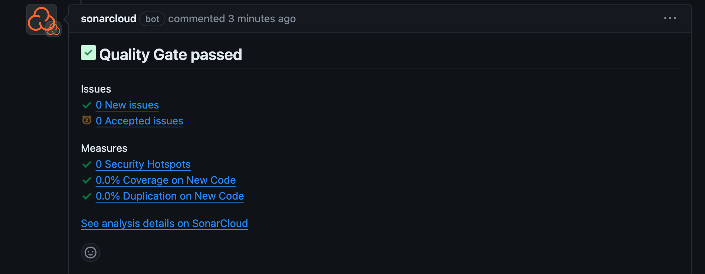
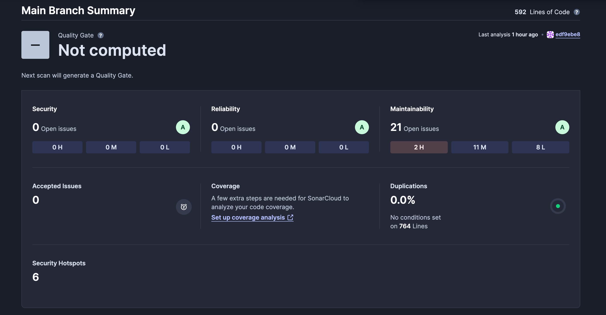
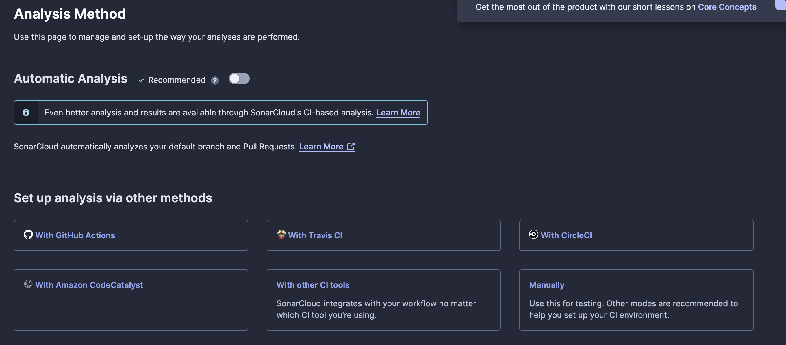

# 정적분석이란?
소스코드의 실행 없이 정적으로 프로그램 문제를 찾는 것 
<-> 동적분석: 런타임 환경에서 우리가 작성한 코드가 안전한지 테스트 코드로 진행

### 주요 분석 해주는 것
- 코드 스멜: 문제를 일으킬 가능성이 농후한 부분 
- 잠재적인 결함
- 컨벤션 체크
- 보안 취약점 
### 정적 분석을 하면 좋은점
- 보안 취약점 방지 
- SW 버그로 생기는 비용 절감 : 탐지하지 못한채로 출시하면 그 만큼 보수 비용이 들어감
- 컨벤션 통일성

# 도입 배경
홀로 개발할 수록 여러명이서 개발하는 것과 같은 환경을 만드는 것이 중요하다고 생각했다. 결국 회사에 가서는 여러명이서 동시에 일하기 때문에 혼자만 아는 코드를 작성하면 되기 때문이다. 또한, 아직 자바에 미숙하기 때문에 최대한 컨벤션이 맞춰서 개발하면 더 좋은 코드를 작성할 수 있을 것으로 기대했다. 보안 취약점이나 문제있는 코드를 개선할 수 있는 점도 도입 계기이다. 

# 주요 정적분석기 툴 
SonarQube : 대표적인 정적분석기 

스코드를 분석하는 Scanner 뿐만아니라 Search와 Compute Engine을 담당하는 서버도 필요하다. 
고로 개인 프로젝트에서 오버스펙일거라고 예상했다. 

SonarCloud: 따로 서버를 마련할 여력이 되지 않는다면 Cloud 서비스를 사용하면 된다. 또는 개인프로젝트에 적용하기 좋아보인다. 

Qodana : JetBrains에서 내놓은 정적분석기로 SonarQube와 같은 기능을 한다. Qodana에서도 Cloud 서비스를 제공한다. 

~~JetBrains 사에서 제공하는 서비스에 모두 만족했기 때문에 Qodana Cloud를 사용해보기로 했다. 
리서치해보니 설치 방법이 SonarCloud에 비해 간단해보인다는 점도 선택한 이유기도 하다. ~~

Qodana는 TestCode Coverage 를 지원하지 않아서 SonarCloud + Jacoco 를 선택하기로 했다. 
SonarCloud는 관련 자료가 많고 Qodana 만큼 튜토리얼이 잘되어 있어서 따라하기 쉬웠다. 

# SonarCloud 사용해보기

[SonarCloud](https://sonarcloud.io/)에 접속하면 SonarCloud를 실행할 레포가 있는 플랫폼으로 회원가입하면 된다. 
SonarCloud 사이트 설명대로 따라하면 된다. (너무  잘 설명해준다..)
처음 정적 분석하면 아래와 같은 그림이 나온다

하지만 CI 마다 정적분석하려면 좀 더 수정해야 한다. 
원하는 레포에서 왼쪽 하단에 `Administration->Analysis Method`으로 들어오면 
![[Pasted image 20240723224057.png]]
Automatic Analysis 를 꺼줘야한다. Set up 방법은 아래 CI 툴에 다라서 설정해주면 된다. 

그럼 아래와 같은 결과를 얻어 낼 수 있다!

# 참조
 - https://jojoldu.tistory.com/662

